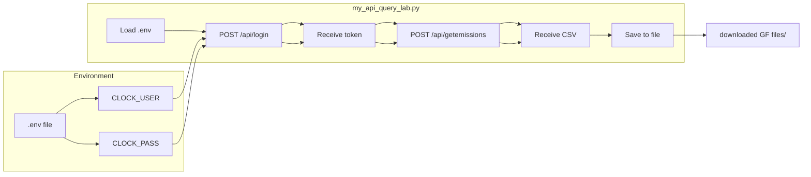
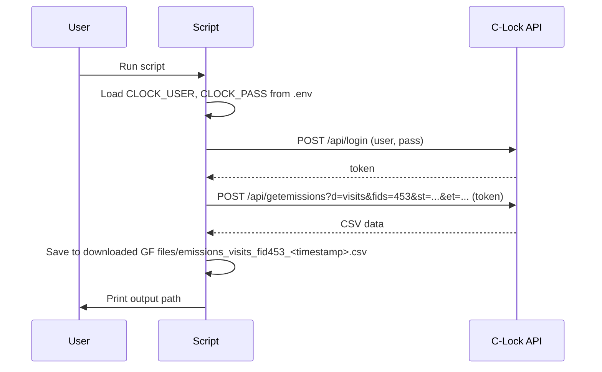

# C-Lock Inc API Query Lab

Documentation for the emissions/visits data query script used in the DSAI 5381 API Query Lab.

---

## Overview

`my_api_query_lab.py` fetches **emissions and visit data** from the C-Lock Inc portal API for a specified feeder over a date range. The script:

1. **Authenticates** with the API using credentials from a `.env` file and receives a session token.
2. **Requests** emissions/visits data for feeder ID `453` from **2025-08-01** to **2025-11-01**.
3. **Saves** the raw CSV response into a local folder `downloaded GF files` with a timestamped filename (e.g. `emissions_visits_fid453_20250206_143022.csv`).

The data is suitable for reporting and analysis (e.g., greenhouse gas emissions per animal visit, airflow, and environmental conditions).

---

## API Endpoint & Parameters

### Authentication

| Item        | Value |
|------------|--------|
| **Endpoint** | `https://portal.c-lockinc.com/api/login` |
| **Method**   | POST (body: `user=<USER>&pass=<PASS>`) |
| **Credentials** | Loaded from `.env`: `CLOCK_USER`, `CLOCK_PASS` |
| **Response** | Plain-text session **token** (used for data requests) |

### Data Request (Get Emissions)

| Item        | Value |
|------------|--------|
| **Endpoint** | `https://portal.c-lockinc.com/api/getemissions` |
| **Method**   | POST (body: `token=<TOK>`) |
| **Query parameters** | See below |

#### Query Parameters

| Parameter | Example / value | Description |
|-----------|------------------|-------------|
| `d`       | `visits`         | Data type: visits (per-visit emissions) |
| `fids`    | `453`            | Feeder ID(s) to query (comma-separated for multiple) |
| `st`      | `2025-08-01_00:00:00` | Start time (inclusive) |
| `et`      | `2025-11-01_12:00:00` | End time (inclusive) |

---

## Data Structure

The API returns **CSV** with one header row. Column names (as sent in the request `Header`) are:

| Column | Description |
|--------|-------------|
| OwnerID | Owner identifier |
| FeederID | Feeder identifier |
| AnimalName | Animal name |
| RFID | RFID tag identifier |
| StartTime | Visit start time |
| EndTime | Visit end time |
| GoodDataDuration | Duration of valid data |
| CO2GramsPerDay | CO₂ (g/day) |
| CH4GramsPerDay | CH₄ (g/day) |
| O2GramsPerDay | O₂ (g/day) |
| H2GramsPerDay | H₂ (g/day) |
| H2SGramsPerDay | H₂S (g/day) |
| AirflowLitersPerSec | Airflow (L/s) |
| AirflowCf | Airflow correction factor |
| WindSpeedMetersPerSec | Wind speed (m/s) |
| WindDirDeg | Wind direction (degrees) |
| WindCf | Wind correction factor |
| WasInterrupted | Whether measurement was interrupted |
| InterruptingTags | Tags that caused interruption |
| TempPipeDegreesCelsius | Pipe temperature (°C) |
| IsPreliminary | Preliminary data flag |
| RunTime | Run time |

Each **row** is one **visit** to the feeder, so the response can contain many rows (10–20+ for the configured date range).

---

## Figures (Mermaid)

The diagrams below are written in [Mermaid](https://mermaid.js.org/). They render as figures on **GitHub**, **GitLab**, and in many Markdown previews (e.g. VS Code with a Mermaid extension). If you don’t see the figures, paste the code into [Mermaid Live Editor](https://mermaid.live) to view or export as PNG/SVG.

### Figure 1 — Flow diagram (login → token → get emissions → save CSV)



### Figure 2 — Sequence diagram (user, script, API)



---

## Usage Instructions

### Prerequisites

- **Python 3** with standard library (no extra packages required for basic HTTP; `python-dotenv` is used for `.env`).
- Install dotenv if needed:
  ```bash
  pip install python-dotenv
  ```

### Setup

1. **Create a `.env` file** in the same directory as `my_api_query_lab.py` (or in the project root if you run from there and load from there):
   ```env
   CLOCK_USER=your_username
   CLOCK_PASS=your_password
   ```
   Use your C-Lock Inc portal credentials.

2. **Optional:** Edit the script to change:
   - `FID` (default `"453"`) — feeder ID
   - `st` and `et` in the URL — start and end time for the query

### Run

From the directory containing the script:

```bash
python my_api_query_lab.py
```

Or with full path:

```bash
python "c:\Users\pn287\OneDrive - Cornell University\Post doc\...\assignment_module01\lab_submission\my_api_query_lab.py"
```

### Output

- A folder **`downloaded GF files`** is created in the same directory as the script (if it does not exist).
- A CSV file is written with a name like:
  `emissions_visits_fid453_YYYYMMDD_HHMMSS.csv`
- The script prints the full path of the saved file, e.g.:
  `Data saved to: ...\lab_submission\downloaded GF files\emissions_visits_fid453_20250206_143022.csv`

### Troubleshooting

| Issue | Check |
|-------|--------|
| Login fails | Verify `CLOCK_USER` and `CLOCK_PASS` in `.env` and that the file is in the right place. |
| No/empty data | Confirm feeder ID `453` and date range have data in the C-Lock portal. |
| `ModuleNotFoundError: dotenv` | Run `pip install python-dotenv`. |

---

*Generated for DSAI 5381 — Data Science and AI for System Engineering (API Query Lab).*
