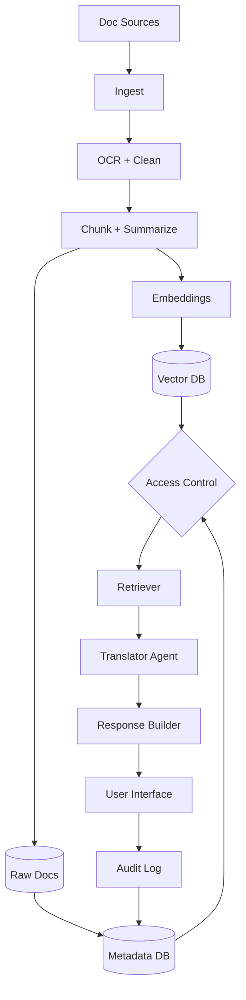

# Task 2: Architecture Design

## Mermaid Diagram

## Design Questions

**How are documents ingested and chunked?**  
Documents enter through an ingestion pipeline from PDFs, legislative text, regulations, emails, and constituent letters. PDFs are OCR'd if needed, cleaned, and split by section, paragraph, page, and legal heading. The system stores both full text chunks and short summaries so the agent can retrieve detailed wording but also orient itself quickly.

**How is access control enforced?**  
Access control is enforced at the database layer using Row Level Security (RLS), not only through the prompt. Each document and chunk receives an access label such as `public`, `staff`, or `classified`. The retriever can only return chunks allowed by the user's role and clearance.

**What database stores the vectors? What stores the raw documents?**  
Vectors are stored in Supabase Postgres with `pgvector`. Raw documents are stored in encrypted object storage, with source metadata and access labels stored in Postgres. This separates large files from searchable vectors while keeping permissions linked.

**Does the agent see raw documents, retrieved chunks, or summaries?**  
The agent mainly sees retrieved chunks and short summaries that have already passed access control. It does not browse the entire raw document store. If a user has proper clearance and the exact source is needed, the interface can show the cited original page or section for staff review.

**What happens when a user queries something above their clearance level?**  
The query still runs, but restricted chunks are filtered out before the agent sees them. The response should say that some relevant material may be unavailable due to access limits and should answer only from authorized sources. It should not reveal titles, contents, or hints from restricted documents.

## Access Tiers

- **Public:** bills, public regulations, public committee summaries, public agency guidance.
- **Staff:** internal memos, draft summaries, non-public constituent correspondence, staff annotations.
- **Classified / Restricted:** national security material, confidential investigations, privileged legal analysis.

## Reliability Controls

- Require citations for every legal or policy explanation.
- Show confidence level and nuance warnings.
- Log retrieved document IDs for audit.
- Refuse to answer when sources are missing or access-filtered material is required.
- Keep a human staff review step for public-facing or legally sensitive outputs.
