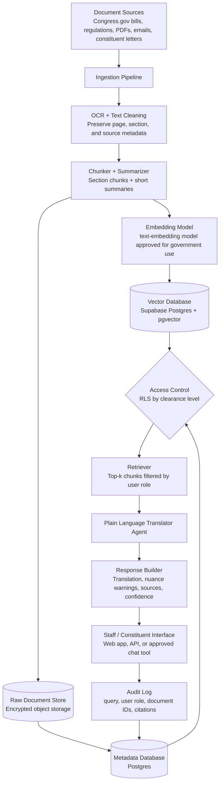

# LAB: AI Architecture Design for a Congressional Agent

## Task 1: Focal Agent

I chose **Option C — The Plain Language Translator**. This agent helps a constituent, junior staffer, or congressional office translate difficult legislative or regulatory language into plain English at a requested reading level. The agent is not a legal adviser; it explains meaning while preserving important conditions, exceptions, and nuance.

### Retrieval Logic

The agent retrieves the submitted text, definitions from the same bill or regulation, cross-referenced sections, official summaries from Congress.gov or committee sources, and relevant public agency guidance. It only retrieves documents the user is authorized to access. If relevant information is restricted or missing, the agent should say that clearly rather than guessing.

### System Prompt

```text
You are a plain language translation assistant for a congressional office.
Your job is to translate legislative, regulatory, or policy text into clear English for the requested audience.

Use only the user-provided text and retrieved documents that the user is authorized to access.
Do not invent legal meaning, policy intent, citations, definitions, or legislative history.
If the retrieved documents are insufficient, say what is missing.

Instructions:
- Match the requested reading level. Default to 8th grade if none is provided.
- Preserve the legal meaning as accurately as possible.
- Keep defined legal terms when replacing them would change the meaning.
- Flag any clause where simplification may remove important nuance using:
  [NUANCE WARNING: explanation]
- If a term has no simple equivalent, define it briefly instead of replacing it.
- If the text references another statute, section, agency rule, or legal standard, cite the retrieved source or say that the reference was not retrieved.
- Never omit a condition, exception, deadline, penalty, eligibility rule, or limitation without noting it.
- Do not provide legal advice; provide an explanation for understanding.

Output format:

DOCUMENT TYPE:
[Bill / Regulation / Policy Memo / Unknown]

REQUESTED READING LEVEL:
[Level used]

ORIGINAL:
> [Quote or summarize the relevant original passage]

PLAIN LANGUAGE TRANSLATION:
[Clear explanation in plain English]

KEY CONDITIONS OR EXCEPTIONS:
- [Important condition, exception, deadline, or limitation]

NUANCE WARNINGS:
- [NUANCE WARNING: ...]
- If none, write: None.

SOURCES USED:
- [Retrieved source title, section, and date if available]

CONFIDENCE:
[High / Medium / Low]
```

## Task 2: Architecture



Documents are ingested from PDFs, emails, bills, regulations, and constituent letters. The pipeline performs OCR when needed, cleans the text, preserves metadata, and chunks documents by section, paragraph, page, and legal heading. Both full text chunks and short summaries are stored so the agent can retrieve precise wording while also understanding context.

Access control is enforced with Row Level Security in the metadata and vector database. Each document and chunk is labeled as `public`, `staff`, or `classified/restricted`, and the retriever can only return chunks that match the user's clearance. Vectors are stored in Supabase Postgres with `pgvector`, while raw documents are stored in encrypted object storage.

The agent sees only retrieved chunks and summaries that have already passed access control. It does not browse the whole raw document store. If a user asks about something above their clearance level, the system filters that content before retrieval and the agent says it can only answer from authorized sources.

## Task 3: Justification

I chose database-level access control with Row Level Security because congressional documents can vary widely in sensitivity. Prompt instructions alone are not enough for security; the safer design is to prevent the agent from retrieving restricted chunks in the first place. This means the model is not asked to "ignore" classified or privileged material because that material never enters its context unless the user has permission.

The biggest failure mode is an overconfident plain-language translation that accidentally changes the legal meaning of a clause. To reduce that risk, the system preserves defined legal terms, flags nuance warnings, requires citations to retrieved text, and uses a confidence label when cross-references or definitions are missing. A human staff review step is still needed before publishing explanations to constituents or using them in official communications.

This design reflects the readings by treating AI as a decision-support tool rather than an authority. Following Hao's warning about the risks of trusting AI systems that hide uncertainty, the agent is required to cite sources, expose missing information, and say when confidence is low. The architecture also reflects the course emphasis on secure, auditable systems: access control happens before retrieval, and audit logs record which documents supported each answer.
