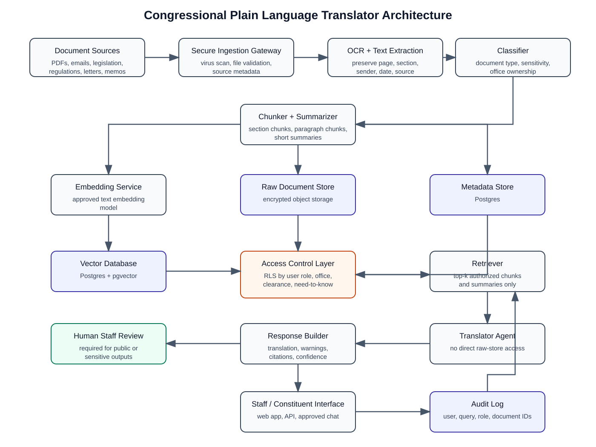
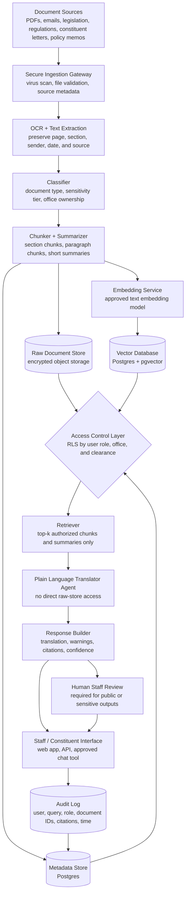

# Task 2: Architecture Design

## Rendered Diagram

## Mermaid Diagram

## Design Questions

### How are documents ingested and chunked?

Documents are ingested through a secure gateway that accepts PDFs, emails, legislative text, regulations, constituent letters, and policy memos. The gateway validates file type, scans for malware, records source metadata, and assigns an initial sensitivity label.

The system uses OCR for scanned PDFs and preserves page numbers, section headings, paragraph numbers, dates, senders, and source URLs. Documents are chunked by legal structure first: title, section, subsection, paragraph, and clause. If a document lacks clear structure, it is chunked by paragraph and page. The system stores both full text chunks and short summaries. Full text supports precise citation, while summaries help retrieval understand context.

### How is access control enforced?

Access control is enforced at the database and retrieval layers, not only in the prompt. Each raw document, metadata record, chunk, summary, and vector receives access attributes such as:

- Access tier: `public`, `staff`, `restricted`, or `classified`.
- Office ownership: which member office or committee owns the document.
- User role: constituent, intern, staffer, counsel, committee staff, or classified-cleared user.
- Need-to-know tags for sensitive matters.

Postgres Row Level Security filters metadata and vector results before the agent receives them. The retriever also applies role and clearance checks, so unauthorized chunks are never placed in the model context.

### What database stores the vectors? What stores the raw documents?

Vectors are stored in **Postgres with pgvector** because it supports vector search while also allowing Row Level Security and metadata filtering in the same database environment. Metadata is stored in regular Postgres tables.

Raw documents are stored in encrypted object storage. The object store contains the original files, while Postgres stores document IDs, source metadata, access labels, chunk locations, and citation information. This separates large files from searchable text while keeping permissions linked to each chunk.

### Does the agent see raw documents, retrieved chunks, or summaries?

The agent sees only authorized retrieved chunks and summaries. It does not have direct access to the raw document store or the full vector database. When the interface needs to show original evidence, it can display the cited page or section to an authorized staff reviewer, but the agent itself works from pre-filtered context.

### What happens when a user queries something above their clearance level?

The access control layer filters out restricted material before retrieval. The agent should not reveal the existence, title, content, or implications of restricted documents. It should answer only from authorized sources and include a limitation statement such as: "I can answer only from sources available to your access level. Some needed definitions or cross-references were not available." If the authorized material is insufficient, the agent should mark confidence as low and recommend staff review.

## Access Tiers

- **Public:** bills, public regulations, public committee summaries, public agency guidance, public press releases.
- **Staff:** internal office memos, draft summaries, constituent correspondence, staff annotations, non-public scheduling or outreach materials.
- **Restricted:** privileged legal analysis, sensitive negotiations, confidential investigations, controlled committee documents.
- **Classified:** national security material available only through approved classified systems and cleared users.

## Reliability Controls

- Require citations for definitions, cross-references, and official interpretations.
- Keep the original text linked to each translation.
- Use confidence labels and nuance warnings.
- Log retrieved document IDs and sources for audit.
- Refuse or limit answers when authorized sources are insufficient.
- Require human staff review before public release or legally sensitive use.