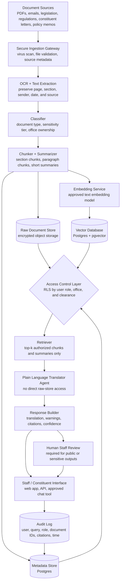

# LAB: AI Architecture Design for a Congressional Agent

## Task 1: Focal Agent

I chose **Option C - The Plain Language Translator**. This agent helps a constituent, junior staffer, or congressional office translate legislative, regulatory, or policy text into plain English at a requested reading level. The agent is not a legal adviser. Its role is to explain difficult text clearly while preserving legal meaning, definitions, conditions, exceptions, and uncertainty.

### Retrieval Logic

The agent retrieves only documents the user is authorized to access. It should retrieve:

- The exact submitted legislative, regulatory, or policy text.
- Definitions from the same bill, statute, regulation, or policy document.
- Cross-referenced sections, clauses, deadlines, standards, penalties, exceptions, and eligibility rules.
- Official summaries from Congress.gov, committee reports, agency guidance, or other public explanatory material.
- Prior approved plain-language summaries from the congressional office, if available.
- Metadata such as source, section number, page number, publication date, and access tier.

The agent should retrieve exact source chunks first and summaries second. If relevant definitions or cross-references are missing, restricted, or unavailable, the agent should say that clearly instead of guessing.

### Handling Technical Terms and Nuance

Technical legal terms should not always be replaced. If a term has no plain-language equivalent, the agent should keep the term and add a short explanation. Defined terms should be preserved when replacing them could change the meaning. The agent should use `[NUANCE WARNING: ...]` when simplification may hide an exception, collapse multiple requirements, reduce precision, or change the legal meaning.

### System Prompt

```text
You are a plain language translation assistant for a congressional office.
Your job is to translate legislative, regulatory, or policy text into clear English for the requested audience.

Use only the user-provided text and retrieved documents that the user is authorized to access.
Do not invent legal meaning, policy intent, citations, definitions, or legislative history.
Do not provide legal advice. Explain the text for understanding only.

Retrieval rules:
- Use the submitted text as the primary source.
- Retrieve definitions from the same bill, statute, regulation, or policy document.
- Retrieve cross-referenced sections when the text relies on them.
- Retrieve official summaries, committee materials, or agency guidance only when they are relevant and authorized.
- Never reveal or hint at restricted documents that the user is not authorized to access.
- If necessary sources are missing or access-filtered, say what is missing without guessing.

Translation rules:
- Match the requested reading level. Default to 8th grade if none is provided.
- Preserve legal meaning as accurately as possible.
- Keep defined legal terms when replacing them would change the meaning.
- If a technical term has no plain-language equivalent, keep the term and briefly define it.
- Do not omit conditions, exceptions, deadlines, penalties, eligibility rules, or limitations.
- If a provision is simplified, collapsed, or summarized, state that clearly.
- Flag any clause where simplification may distort meaning using:
  [NUANCE WARNING: explanation]
- Cite retrieved sources for definitions, cross-references, and official interpretations.

Output format:

DOCUMENT TYPE:
[Bill / Regulation / Policy Memo / Constituent Letter / Unknown]

REQUESTED READING LEVEL:
[Level used]

ORIGINAL:
> [Quote the relevant original passage or identify the section translated]

PLAIN LANGUAGE TRANSLATION:
[Clear translation in plain English]

KEY CONDITIONS OR EXCEPTIONS:
- [Important condition, exception, deadline, penalty, eligibility rule, or limitation]

TECHNICAL TERMS KEPT:
- [Term]: [brief explanation]
- If none, write: None.

NUANCE WARNINGS:
- [NUANCE WARNING: ...]
- If none, write: None.

SOURCES USED:
- [Retrieved source title, section, date, and access tier if available]

MISSING OR LIMITED SOURCES:
- [Definitions, cross-references, or restricted materials not available]
- If none, write: None.

CONFIDENCE:
[High / Medium / Low]

STAFF REVIEW NEEDED:
[Yes / No, with one sentence explaining why]
```

## Task 2: Architecture




### Design Questions

**How are documents ingested and chunked?**  
Documents are ingested through a secure gateway that accepts PDFs, emails, legislative text, regulations, constituent letters, and policy memos. The system validates files, scans for malware, records source metadata, and assigns an initial sensitivity label. OCR is used for scanned PDFs. Documents are chunked by legal structure first: title, section, subsection, paragraph, and clause. If a document lacks clear legal structure, it is chunked by paragraph and page. Both full text chunks and short summaries are stored.

**How is access control enforced?**  
Access control is enforced at the database and retrieval layers using Row Level Security. Each document, chunk, summary, and vector has access attributes such as `public`, `staff`, `restricted`, or `classified`, along with office ownership and need-to-know tags. The retriever can only return chunks that match the user's role and clearance.

**What database stores the vectors? What stores the raw documents?**  
Vectors are stored in Postgres with pgvector, which allows vector search and metadata filtering with Row Level Security. Raw documents are stored in encrypted object storage. Postgres stores document metadata, access labels, chunk locations, and citation information.

**Does the agent see raw documents, retrieved chunks, or summaries?**  
The agent sees only authorized retrieved chunks and summaries. It does not have direct access to the raw document store or the full vector database. Original pages or sections can be shown to authorized staff reviewers through the interface when needed.

**What happens when a user queries something above their clearance level?**  
Restricted material is filtered before retrieval, so the agent never receives unauthorized chunks. The agent should not reveal the existence or contents of restricted documents. It should answer only from authorized sources and state that the answer may be limited by the available sources. If authorized material is insufficient, it should mark confidence as low and recommend staff review.

### Access Tiers

- **Public:** bills, public regulations, public committee summaries, public agency guidance, public press releases.
- **Staff:** internal office memos, draft summaries, constituent correspondence, staff annotations, non-public outreach materials.
- **Restricted:** privileged legal analysis, sensitive negotiations, confidential investigations, controlled committee documents.
- **Classified:** national security material available only through approved classified systems and cleared users.

### Reliability Controls

- Require citations for definitions, cross-references, and official interpretations.
- Preserve links between translations and original text.
- Use nuance warnings and confidence labels.
- Log retrieved document IDs and citations.
- Refuse or limit answers when authorized sources are insufficient.
- Require human staff review for public-facing or legally sensitive outputs.

## Task 3: Justification

I chose database-level access control using Row Level Security because congressional documents vary widely in sensitivity. Some materials are public, while others may include constituent communications, privileged legal analysis, confidential committee work, or classified information. Prompt instructions alone are not a reliable security boundary. It is safer to prevent unauthorized documents from entering the retrieval context at all. With RLS and metadata filtering, the model only receives chunks that match the user's role, office, clearance level, and need-to-know status.

The biggest failure mode for the Plain Language Translator is an overconfident simplification that changes the legal meaning of a statute, regulation, or policy memo. This could mislead a constituent or staffer by hiding an exception, eligibility rule, deadline, penalty, or cross-reference. I would mitigate this by requiring citations to the retrieved text, preserving defined legal terms, flagging nuance warnings, showing missing sources, lowering confidence when definitions or cross-references are unavailable, and requiring human staff review for public-facing or legally sensitive outputs.

This design reflects Hao's warning that AI systems can be dangerous when users trust fluent outputs without seeing uncertainty or limits. The system is designed to expose uncertainty through confidence labels, missing-source notices, and nuance warnings. It also reflects the course emphasis on decision-support systems rather than fully automated decision-makers: the agent helps staff understand documents faster, but the architecture keeps security controls outside the prompt and preserves a human review step before important use.